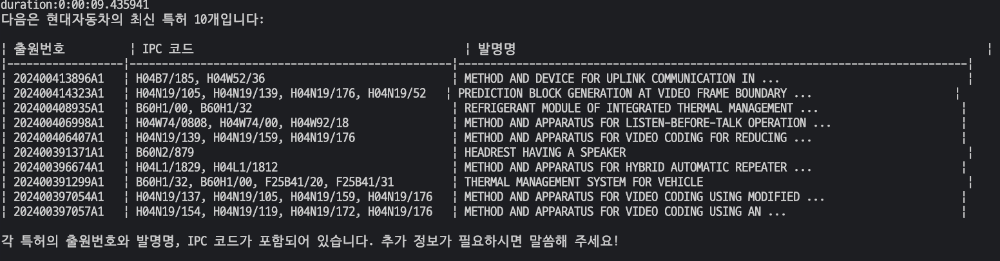
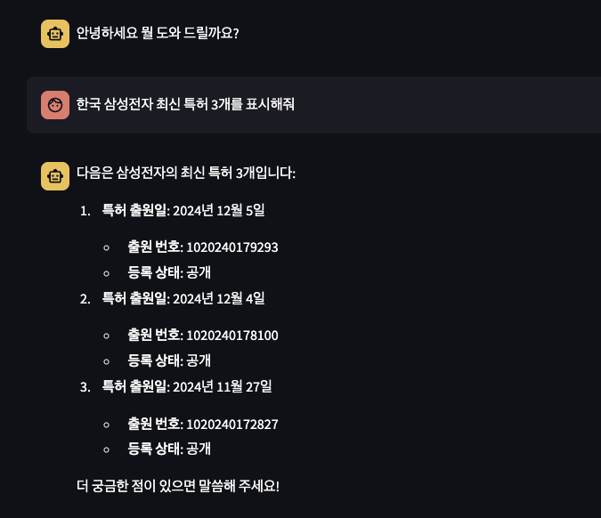

# langchain_kipris_tools

plus.kipris.or.kr 에서 제공하는 api_key를 이용하여 특허를 검색하는 langchain tool 구현체입니다.
api_key는 본인의 키를 사용해야 합니다.
가입은 [link](http://plus.kipris.or.kr/portal/main.do) 에서 가입 후 사용 가능합니다.

사용 예제

```python
import os
os.environ["KIPRIS_API_KEY"] = ''

from langchain_kipris_tools import LangChainKiprisKoreanTools
kipristools = LangChainKiprisKoreanTools()
tools = kipristools.get_tools()
```

제공하는 api 목록

| 순번 |국가| api 명칭                     | 설명                | 참조 url                                                                                                                                                                                 |
| ---- | ----|------------------------ | ------------------- | ---------------------------------------------------------------------------------------------------------------------------------------------------------------------------------------- |
| 1    | 한국| patent_search_tool           | 특허 전체 검색      | [link](https://plus.kipris.or.kr/portal/popup/DBII_000000000000001/SC002/ADI_0000000000002944/apiDescriptionSearch.do)                                                                      |
| 2    | 한국| patent_keyword_search_tool   | 특허 키워드 검색    | [link](https://plus.kipris.or.kr/portal/popup/DBII_000000000000001/SC002/ADI_0000000000010162/apiDescriptionSearch.do)                                                                      |
| 3    | 한국| patent_applicant_search_tool | 특허 출원인 검색    | [link](https://plus.kipris.or.kr/portal/popup/DBII_000000000000001/SC002/ADI_0000000000015118/apiDescriptionSearch.do)                                                                      |
| 4    | 한국| patent_righter_search_tool   | 특허 권리자 검색    | [link](https://plus.kipris.or.kr/portal/data/service/DBII_000000000000001/view.do?menuNo=200100&kppBCode=&kppMCode=&kppSCode=&subTab=SC001&entYn=N&clasKeyword=#soap_ADI_0000000000015121)  |
| 5    | 한국| patent_number_search_tool    | 특허 출원 번호 검색 | [link](https://plus.kipris.or.kr/portal/data/service/DBII_000000000000001/view.do?menuNo=200100&kppBCode=&kppMCode=&kppSCode=&subTab=SC001&entYn=N&clasKeyword=#soap_ADI_0000000000010163)  |
| 6    | 해외| free_search    | 해외 특허 자유 검색 | [link](https://plus.kipris.or.kr/portal/popup/service/DBII_000000000000036/view.do#soap_ADI_0000000000001478)  |
| 7    | 해외| applicant_search_tool    | 해외 특허 출원인 검색 | [link](https://plus.kipris.or.kr/portal/popup/service/DBII_000000000000036/view.do#soap_ADI_0000000000001500)  |
| 8    | 해외| application_number_search_tool    | 해외 특허 출원 번호 검색 | [link](https://plus.kipris.or.kr/portal/popup/service/DBII_000000000000036/view.do#soap_ADI_0000000000001488)  |
| 9    | 해외| internationl_application_number_search_tool    | 해외 특허 국제 출원 번호 검색 | [link](https://plus.kipris.or.kr/portal/popup/service/DBII_000000000000036/view.do#soap_ADI_0000000000001503)  |
| 10   | 해외| internationl_open_number_search_tool    | 해외 특허 국제 공개 번호 검색 | [link](https://plus.kipris.or.kr/portal/popup/service/DBII_000000000000036/view.do#soap_ADI_0000000000001492)  |

- 해외 특허는 권리자 검색이 kipris에서 제공하지 않습니다. 
- 해외 특허 국가 코드 
```python
country_code_dict = {
    "US": "미국",
    "EP": "유럽",
    "WO": "PCT",
    "JP": "일본",
    "PJ": "일본영문초록",
    "CP": "중국",
    "CN": "중국특허영문초록",
    "TW": "대만영문초록",
    "RU": "러시아",
    "CO": "콜롬비아",
    "SE": "스웨덴",
    "ES": "스페인",
    "IL": "이스라엘"}
```

# Example 한국 특허 

```python
import os

from dotenv import load_dotenv
from langchain_core.messages import HumanMessage

# 본인의 kipris api key가 KIPRIS_API_KEY 환경변수에 저장되어 있어야 합니다.
# os.environ["KIPRIS_API_KEY"]='사용자 발급 api key'
from langchain_openai import ChatOpenAI
from langchain_kipris_tools import LangChainKiprisKoreanTools


load_dotenv()
tool_class = LangChainKiprisKoreanTools()
kipris_tools = tool_class.get_tools()
llm = ChatOpenAI(model="gpt-4o-mini")

def call_with_tool(query, tools):
    from datetime import datetime as dt
    start = dt.now()

    llm_with_tools = llm.bind_tools(tools)
    chain = llm_with_tools 
    messages = [HumanMessage(query)]
    ai_msg = chain.invoke(messages)
    messages.append(ai_msg)

    for tool_call in ai_msg.tool_calls:
        selected_tool = {
            "applicant_search": tools[0], 
            "patent_keyword_search": tools[1], 
            "patent_search":tools[2],
            "application_number_search":tools[3],
            "righter_search":tools[4]
            }[tool_call["name"].lower()]
        tool_msg = selected_tool.invoke(tool_call)
        print(f'call {selected_tool.name}')
        print(tool_call)
        messages.append(tool_msg)
    result = llm_with_tools.invoke(messages).content
    duration = dt.now() - start
    print(f'duration:{duration}')
    return result

result = call_with_tool("최신 특허중 현대자동차 특허 10개를 표시해줘, 표시항목에 출원인도 포함해서 보여줘", kipris_tools)
```


# Example 해외 특허 
- 해외 특허 검색시 나라를 지정하지 않으면 기본적으로 미국으로 검색 합니다. 

```python
import os

from dotenv import load_dotenv
load_dotenv()
import traceback
# 본인의 kipris api key가 KIPRIS_API_KEY 환경변수에 저장되어 있어야 합니다.
# os.environ["KIPRIS_API_KEY"]='사용자 발급 api key'
from langchain_core.messages import HumanMessage
from langchain_core.output_parsers import PydanticToolsParser
from langchain_openai import ChatOpenAI
from pydantic import BaseModel, Field
from langchain_core.messages import ToolMessage
from langchain_kipris_tools import LangChainKiprisForeignTools

tool_class = LangChainKiprisForeignTools()
kipris_tools = tool_class.get_tools()
llm = ChatOpenAI(model="gpt-4o-mini")

def call_with_tool(query, tools):   
    from datetime import datetime as dt
    start = dt.now()

    llm_with_tools = llm.bind_tools(tools)
    messages = [HumanMessage(content=query)]
    ai_msg = llm_with_tools.invoke(messages)
    
    # tool_calls가 있는 경우에만 처리
    # 아래 코드는 cursor 에서 작성된 코드입니다. 
    # 원본 코드는 example/example_foreign.py 에 있습니다. 
    # 생각보다 cursor가 삽질을 꽤 합니다. ㅡㅡ;
    if hasattr(ai_msg, 'tool_calls') and ai_msg.tool_calls:
        # 먼저 assistant 메시지 추가
        messages.append(ai_msg)
        
        # 각 tool 호출에 대한 응답 처리
        for tool_call in ai_msg.tool_calls:
            tool_name = tool_call['name']
            print(f"tool_name: {tool_name}")
            try:
                tools_dict = {tool.name.lower(): tool for tool in tools}
                tool_name = tool_call['name'].lower()
                
                if tool_name not in tools_dict:
                    print(f"경고: '{tool_name}' 도구를 찾을 수 없습니다.")
                    # 도구를 찾을 수 없는 경우에도 빈 응답 추가
                    messages.append(ToolMessage(
                        tool_call_id=tool_call['id'],
                        content="도구를 찾을 수 없습니다.",
                        name=tool_name
                    ))
                    continue
                
                selected_tool = tools_dict[tool_name]
                print(f"selected_tool: {selected_tool}")
                tool_result = selected_tool.invoke(tool_call)
                
                # 반드시 각 tool_call에 대한 응답 추가
                messages.append(ToolMessage(
                    tool_call_id=tool_call['id'],
                    content=str(tool_result),
                    name=tool_name
                ))
                
            except Exception as e:
                print(f"도구 실행 중 오류 발생: {str(e)}")
                print(traceback.format_exc())
                # 오류 발생시에도 응답 추가
                messages.append(ToolMessage(
                    tool_call_id=tool_call['id'],
                    content=f"오류 발생: {str(e)}",
                    name=tool_name
                ))
        
        # 모든 tool 응답을 처리한 후 최종 응답 생성
        final_response = llm_with_tools.invoke(messages)
        duration = dt.now() - start
        print(f'duration:{duration}')
        return final_response.content
    
    duration = dt.now() - start
    print(f'duration:{duration}')
    return ai_msg.content

result = call_with_tool("최신 특허중 현대자동차 특허 10개를 표시해줘, 표시항목에 출원인도 포함해서 보여줘", kipris_tools)
# 위와 같이 검색하게 되면 해외 특허 검색시 사용자의 키워드를 영문으로 바꿔서 검색하는데 가끔씩 영문 전환이 제대로 안되서 
# 검색이 안되는 경우가 있습니다. 
# 해외 특허 검색 tool 사용시에는 LLM을 통해 검색하고자 하는 국가의 키워드로 바꾸거나 영문으로 바꾸는것을 추천 합니다. 

print(result)
```
동작 결과 



Streamlit 예제 


변경 내역 

- 2024-12-28 
    - 해외 특허 검색 추가 
        - api/tool 추가 
            - 해외 특허 자유 검색
            - 해외 특허 출원인 검색
            - 해외 특허 출원 번호 검색
            - 해외 특허 국제 출원 번호 검색
            - 해외 특허 국제 공개 번호 검색
    - 해외 특허 검색 예제 코드 추가 
    - package/class 명칭 변경 
        - 한국 특허 : PatentKorean prefix 추가 
        - 해외 특허 : PatentForeign prefix 추가 
    - 한국 특허 출원 번호 검색 버그 수정


- 2024-12-25 
    - 패키지 의존성 변경
        - Langgraph 의존성 추가
        - Redis 의존성 추가
    - Langgraph의 graph에서 사용할 Node Template 추가
    - Langgraph의 checkpoint 추가
        - Redis 사용
        - 원본 : [link](https://github.com/langchain-ai/langgraph/blob/main/docs/docs/how-tos/persistence_redis.ipynb)
    - Kipris tool 패키지 구조 변경 내역 코드 반영.
        - LangchainKiprisKoreanTools 명칭 변경
        - LangchainKiprisTools -> LangchainKiprisKoreanTools 명칭 변경
    - 예제 코드 수정 
        패키지/클래스 변경에 따른 변경. 


- 2024-11-23
    - 한국 및 해외 검색 도구 추가를 위한 구조 변경
    - 특허 검색 API 추가
        - 권리자 검색
        - 출원번호 검색

- 2024-11-11
    - 테스트 코드 추가 
    - 예제 코드 추가 
    - 아규먼트 처리 로직 수정


- 2024-11-10
    - 최초 작성
